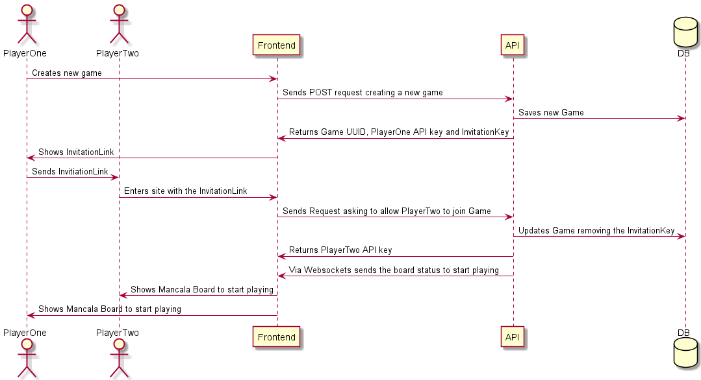
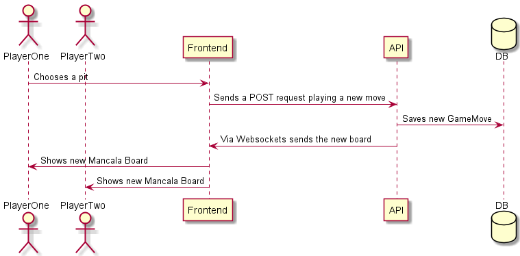

# Mancala

The game is divided in two projects

- Backend
- Frontend

## Quick setup

1) Create a database in PostgresSQL

```sql
psql> create database mancala;
```

2) Run backend server

```sh
backend$ ./gradelw tasks bootRun
```

You can override default values using environment variables.

3) Run frontend server

```sh
frontend$ npm install
frontend$ npm run serve
```

## Backend

Is a `Java/Kotlin spring-boot`  application that consists of two modules. One is the `lib` that has all the game logic and the other one is the REST `api` implementation.

### Technologies

- Java 11
- Kotlin
- Spring Boot
- Websockets
- Junit
- PostgresSQL

### Databases

We are using PostgreSQL as the database. We will need two instances. One for the app and another one for the integrations tests.

The default values for the local environment are:

```sh
database name: mancala
username: postgres
password: postgres
```

And for testing

```sh
database name: mancala-test
username: postgres
password: postgres
```

### Environment variables

- APP_PORT
- DB_HOST
- DB_NAME
- DB_USERNAME
- DB_PASSWORD

### How to run it locally

It will start a local server in the port `8081`

```sh
backend$ ./gradelw tasks bootRun
backend> .\gradelw.bat tasks bootRun
```

You can override it setting the `env` variable `APP_PORT`

### How to run tests

```sh
backend$ ./gradelw test --info
backend> .\gradelw.bat test --info
```

### Swagger

The local url of Swagger is `http://localhost:8081/swagger-ui/`

## Frontend

Is a `Vue.js` applications that consumes the data from the `api` and allows a user to play or to view how two players play the game.

### Technologies

- Vue.js
- Websockets

### How to run it locally

It will start a local server in the port `8080`

```sh
frontend$ npm run serve
```

## Common Workflows

### Init Game



### Playing

